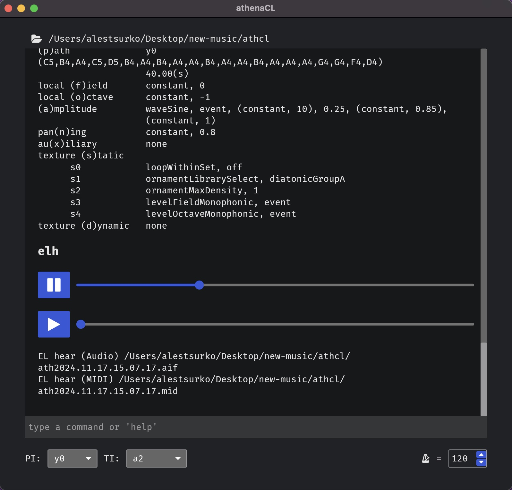

# athenaCL



athenaCL is an algorithmic composition tool created by Christopher Ariza.

Or, as described by the author more specifically, it is a tool for:
> modular poly-paradigm algorithmic music composition in a cross-platform
> interactive command-line environment.


## Documentation

The manual is built using [mdBook](https://rust-lang.github.io/mdBook) you will
find the source code inside `doc/` directory. You can read it 
[here](https://alestsurko.by/athenaCL/).


## Usage

Run this once after you cloned this repo:

```
make init
```

Then you can run the program using:

```
make run
```

`make test` will run not only rust tests, but python tests as well.
`cargo-nextest` is required.


### Bundle an app on macOS

Bundling requires [`cargo-bundle`](https://crates.io/crates/cargo-bundle).
Only macOS is configured currently. To bundle a package:

```
make pack-macos
```

After that the .app package should be located at
`target/release/bundle/osx/athenaCL.app`.


## About This Fork

Initially this repo was forked to update the code to python3. But then I
considered to build a GUI version of **athenaCL**. Today the code is adapted for
GUI needs:

- it's modified to be easily embeddable into binary (using **RustPython** and
  freezing);
- some features related to CLI are removed, to make it work better with
  **RustPython**;
- while the CLI version might still work, it's not supported, so expect bugs.

If you're interested in the original (CLI) version, check out the
[`pregui`](https://github.com/ales-tsurko/athenaCL/releases/tag/pregui) tag.
