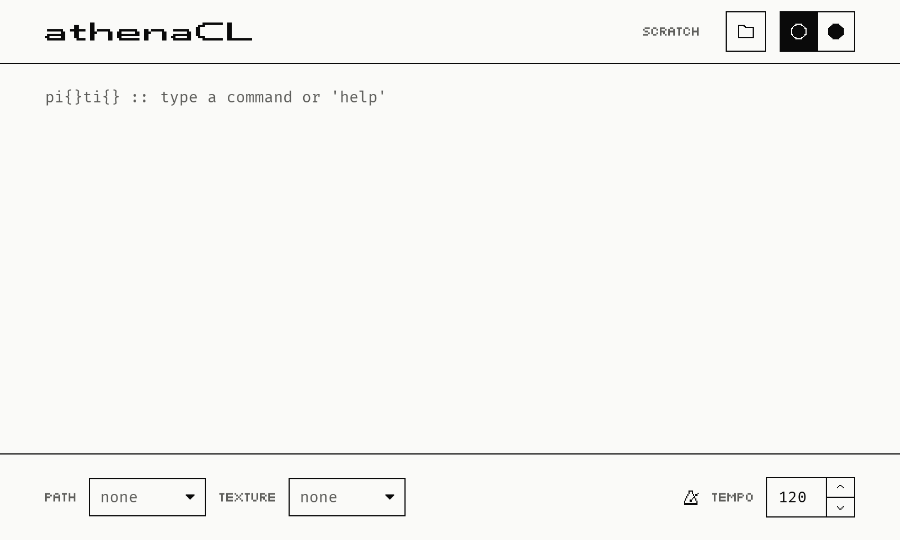

# Starting the athenaCL Interpreter

athenaCL is a single application: open it as you would any other program on your
platform. Everything it needs, including its Python interpreter, is built into
the application, so there is nothing to install alongside it.

The window opens on the athenaCL prompt, with the caret already in it: a command
can be typed straight away. Commands are entered at the prompt, and what they
print appears above it, in the log. Enter `cmd` to see all commands, `help` for
help with one of them, and `AUdoc` to read this manual inside the application.


## The athenaCL prompt

```
pi{}ti{} :: type a command or 'help'
```

The athenaCL prompt "::" is preceded by information concerning the AthenaObject.
The active PathInstance is named within "pi{}", and the active TextureInstance
within "ti{}"; both are empty until one is created. This will be explained in
greater detail below.

Around the log, the window carries the things that would otherwise need a
command: above it, the scratch directory athenaCL writes its files to, with a
button to change it, and a switch between the light and the dark look; below it,
the active Path and Texture, and the tempo the built-in player plays at.


