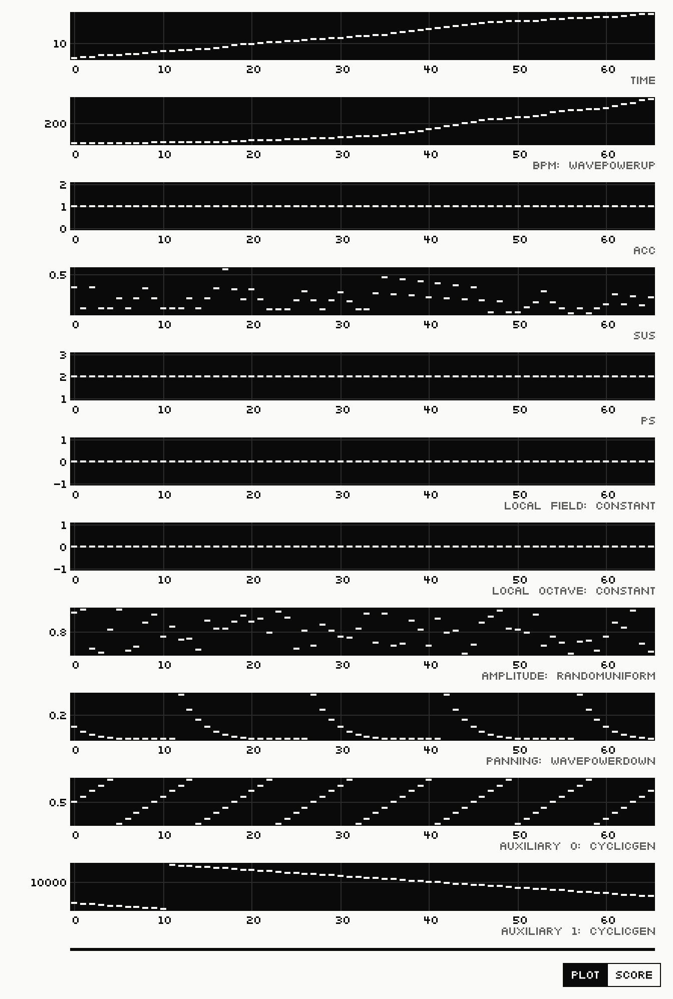
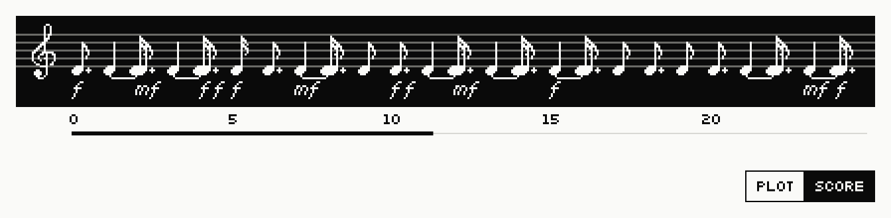

# Displaying Texture Parameter Values

It is often useful to view the values produced by a Texture with a graphical
diagram. The command `TImap` provides a multi-parameter display of all raw
values input from ParameterObjects into the Texture. The values displayed by
`TImap` are pre-TextureModule, meaning that they are the raw values produced by
the ParameterObjects; the final parametric event values may be altered or
completely changed by the Texture's internal processing (its TextureModule) to
produce different arrangements of events. The `TImap` command thus only provides
a partial representation of what a Texture produces.

The command `TImap` displays the active Texture, drawn in the log below the
command:


## Viewing a Texture with `TImap`

```
pi{auto-muteHiConga}ti{b1} :: timap
TImap (event-base, pre-TM) display complete.
```



The switch under the map shows the same Texture as a score instead: its events
as notes, along the same time as the graphs.


