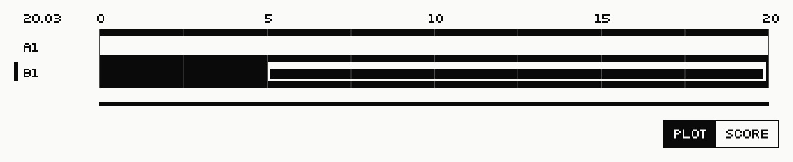

# Muting Textures

Textures can be muted to disable the inclusion of their events in all
EventOutputs. Textures and their Clones (see
[Tutorial 6: Textures and Clones][tutorial-6]) can be muted independently. The
command `TImute`, if no arguments are given, toggles the current Texture's mute
status. The following example demonstrates muting the active Texture, b1,
listing all Textures with `TIls`, and then displaying the collection of Textures
with the `TEmap` command. Notice that in the `TIls` display, the "status" of
Texture b1 is set to "o", meaning that it is muted.


## Muting a Texture with `TImute`

```
pi{auto-muteHiConga}ti{b1} :: timute
TI b1 is now muted.

pi{auto-muteHiConga}ti{b1} :: tils
TextureInstances available:
{name,status,TM,PI,instrument,time,TC}
   a1               + LineGroove  auto-lowConga    64  00.0--20.0   0
 + b1               o LineGroove  auto-muteHiConga 62  05.0--20.0   0

pi{auto-muteHiConga}ti{b1} :: temap
TEmap display complete.
```



By providing the name of one or more Textures as command-line arguments,
numerous Texture's mute status can be toggled. In the following example, Texture
a1 is given as an argument to the `TImute` command, and the `TIls` command shows
that both Textures are now muted. Given again, a Texture's name removes its mute
status.


## Removing mute status with `TImute`

```
pi{auto-muteHiConga}ti{b1} :: timute a1
TI a1 is now muted.

pi{auto-muteHiConga}ti{b1} :: tils
TextureInstances available:
{name,status,TM,PI,instrument,time,TC}
   a1               o LineGroove  auto-lowConga    64  00.0--20.0   0
 + b1               o LineGroove  auto-muteHiConga 62  05.0--20.0   0

pi{auto-muteHiConga}ti{b1} :: timute a1
TI a1 is no longer muted.

pi{auto-muteHiConga}ti{b1} :: timute b1
TI b1 is no longer muted.
```

[tutorial-6]: ../chapter06/01-tutorial-6-textures-and-clones.md
